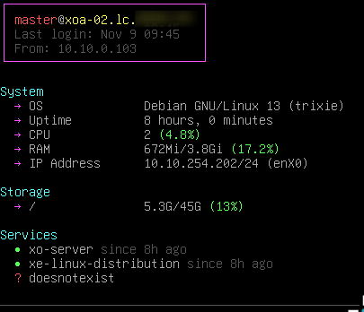
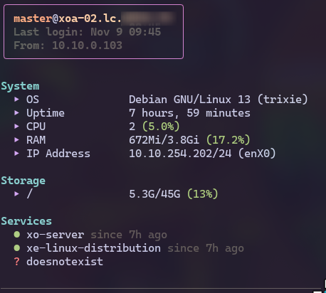

# LoginDash

A lightweight terminal dashboard that shows real‑time system information when you log in via SSH.
It is written in Go and renders a coloured, easy‑to‑read summary of:

- **System** – uptime, CPU usage, RAM usage, IP address, default gateway, DNS servers
- **Storage** – root and mounted drives
- **Services** – status of user‑selected systemd services

The dashboard is configurable via a TOML file and can be integrated into your
`~/.ssh/rc` or `~/.bashrc` so that it displays automatically on login.

## Features

| Feature | Description |
|---------|-------------|
| **Dynamic storage** | Scan `/mnt` for new mounts automatically. |
| **Service monitoring** | Show the status of any systemd service you care about. |
| **Portable** | Standard Linux utilities depedencies (`top`, `free`, `df`, `systemctl`, etc.). |
| **Customizable** | Remove unwanted labels, change colors or adjust `label_width` via `config.toml` |

## Showcase

|Debian in console|Debian through ssh with ghostty + nerdfonts|Arch local - all labels + added mountpath|
| --------------- | ----------------------------------------- | --------------------------------------- |
|  |  |  |

## Installation/Updating

### Automated

> Review the `install.sh` code

```bash
curl -fsSL "https://raw.githubusercontent.com/BOAScripts/logindash/refs/heads/main/install/install.sh" | bash
```

### Build it yourself

1. **Clone the repo**

   ```bash
   git clone https://github.com/BOAScripts/logindash.git
   cd logindash/
   ```

2. **Build**

   ```bash
   go build -o logindash
   ```

3. **Place the binary**

   ```bash
   sudo mv logindash /usr/local/bin/
   ```

4. **Copy/Edit the config file**

  ```bash
  mkdir -p ~/.config/logindash
  cp config/config.toml ~/.config/logindash/config.toml
  ```

## Usage

```bash
logindash
```

### Options

| Options | Description |
| ------- | ----------- |
| `--config <path>` | Path to the configuration file |
| `-h`, `--help` | Show help |

Default config path: `~/.config/logindash/config.toml`.

```bash
logindash --config ~/.mylogindashconfig.toml
```

### Auto‑run on SSH login

Add the following lines in your `~/.ssh/rc` (or `~/.bashrc`, ...):

```bash
if [ -e "/usr/local/bin/logindash" ]; then
    logindash
fi
```

## Configuration

Open `~/.config/logindash/config.toml`:

```toml
[display]
label_width = 15 # default = 15
green_until = 65 # default = 65
orange_until = 85 # default = 85

[display.options]
"system.os" = true
"system.uptime" = true
"system.cpu" = true
"system.ram" = true
"system.ip" = true
"system.gateway" = false
"system.dns" = false
"storage.root" = true

[colors]
header = "#ea76cb"
title = "#8bd5ca"
label = "#c6a0f6"
user = "#f5a97f"
fqdn = "#eed49f"
dim = "#494d64"
active = "#a6da95"
inactive = "#ee99a0"
failed = "#ed8796"
green = "#a6da95"
orange = "#f5a97f"
red = "#ed8796"

[disks]
paths = ["/home"]

[services]
monitored = [
    "docker",
    "sshd",
    "doesnotexists"
    ]
```

| Settings | Description |
| -- | -- |
| `display.label_width` | Width of the left‑hand label column. This ensure the values to be on the same x-axis |
| `display.green_until` `orange_until` | Thresholds for colour coding the usage percentages. (green from 0 to 65, orange from 66 to 85, rest is red) |
| `display.options.{item}` | Set to false if you want to hide specific items |
| `colors.{item}` | Color overwrite, HEX code recommended |
| `disks.paths` | Additional paths to display disk usage for. If it's not mounted it won't be displayed |
| `services.monitored` | Systemd services to monitor |

## Customization

- **Thresholds** – Adjust `green_until` and `orange_until` to suit your monitoring style.
- **Mount detection** – The program automatically scans `/mnt` for new mounts. You can add paths in the config as needed.
- **Colours** – Edit the `[colors]` HEX codes in `~/.config/logindash/config.toml` to change the palette.

## Disclaimer

> This project was assisted by AI tools (Claude Sonnet 4.5 & gpt-oss) - apologies for any oversight.
